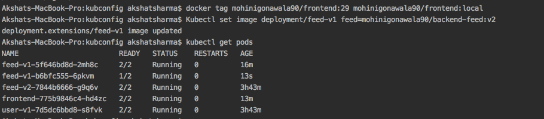

# Udagram Microservices


This project is a part of Udacity Cloud Developer nanodegree.
Main goal is to learn how to divide a monolith application into microservices.

Here, Monolith application has been divided into three separate services.
1.  Frontend (Iconic APP)
2.  Feed microservice (Node.js)
3.  User microservice (Node.js)

#### Goals

1.  Application should allow users to signup and login via a web client.
2.  It should allow users to create a feed, whose details will be stored in postgress on AWS.
3.  User should be able to upload images, which will be stored on AWS S3.
4.  User should be able to view all the feeds along with their images.
5.  Each service should be containerized and deployed in a Kubernetes cluster.
6.  Each service should be able to scale out and scale in independently.
7.  Application should have integrated CI/CD process.
8.  Application should support A/B deployment strategy.

## Getting Started

These instructions will help you set up a copy of the project and run it on local system or on AWS EKS cluster.

### Prerequisites

1. Install below dependencies.

    [Docker](https://docs.docker.com/get-docker/)
    
    [Docker-compose]()
  
    [AWS cli](https://docs.aws.amazon.com/cli/latest/userguide/cli-chap-install.html)
  
    [Eksctl](https://docs.aws.amazon.com/eks/latest/userguide/getting-started.html)
  
    [Kubectl](https://kubernetes.io/docs/tasks/tools/install-kubectl/)
 
    [Istio]()


### Instalation & setup

* Clone this project on your local machine

````
git clone https://github.com/mgonawala/udagram-microservices.git
````

* Build docker images for each service
```
cd udacity-c3-deployment/docker
docker-compose -f docker-compose-build.yaml build
```

* Check docker images on local docker registry after successful build.

````
docker images
````


* Set Environment variables

````
POSTGRESS_USERNAME: "your_username"
POSTGRESS_PASSWORD: "your_password" 
POSTGRESS_DB: "your_db" 
POSTGRESS_HOST: "your_db_host" 
AWS_REGION: "your_aws_region" 
AWS_PROFILE: "your_profile" 
AWS_BUCKET: "your_bucket"
JWT_SECRET: "any_long_secret_key"
````

* Run whole application

````
docker-compose up
````

* Check if you application is running

```
curl http://localhost:8100/api/v0/feed
```

* Go to localhost:8100 in browser and see if it is working as per below.

  
  
* push docker images to docker hub registry

```
docker login -u username -p password
docker push your_docker_username/imagename:tag
```

* Check your docker images in docker hub registry


## Deploy application on Local cluster using Minikube

* Follow this link to setup a local cluster using Minikube [link](https://kubernetes.io/docs/setup/learning-environment/minikube/#minikube-features)

* Install istio  `` sh setup-istio.sh``

* Edit aws-secret.yaml file with your base64 encoded ~/.aws/credentials file

`cat ~/.aws/credentials | base64 `

* Edit env-cofnigmap.yaml file with your connection details

* Edit env-secret file with your DB password and username 

`echo username| base64 ; echo passowrd | base64 `

*  Configure services & gateway on cluster with below commands. It will set up deployemnt, services and gateway.
```
kubectl apply -f udacity-c3-deployment/kubconfig/aws-secret.yaml
kubectl apply -f udacity-c3-deployment/kubconfig/env-configmap.yaml
kubectl apply -f udacity-c3-deployment/kubconfig/env-secret.yaml
kubectl apply -f udacity-c3-deployment/kubconfig/myappinfo.yaml
kubectl apply -f udacity-c3-deployment/kubconfig/frontend-deployment.yaml
kubectl apply -f udacity-c3-deployment/kubconfig/destination-rules.yaml
kubectl apply -f udacity-c3-deployment/kubconfig/myapp-gateway.yaml
```

* Check your deployments
```
kubectl get deployment
```


* check your services
```
kubectl get svc
```


* Browse to ``http://localhost:8100/`` to check if your application is running.


## Rolling update

This section demonstrates how to rollout update with little downtime.
To update the deployed image of feed service, issue following command

`Kubectl set image deployment/feed-v1 feed=mohinigonawala90/backend-feed:v2`

`deployment.extensions/frontend image updated`




>_Here we have two versions of Feed service deployed.
Traffic will be routed to specific feed service based on Header parameter **api-version**.
**api-version** **v1.0.0** will be routed to feed-v1.
**api-version** **v2.0.0** will be routed to feed-v2.
If no header is provided, it defaults to feed-v1._ 


## CI/CD with travis CI

This application is configured with Travis CI for continuous Integration/continuous deployment.
Each commit on the GitHUB will trigger a build & deploy to AWS EKS cluster.


## To setup your own pipeline please follow below steps:

1.  Go to Travis-ci.com and sign up with your GitHub account.
2.  Accept the authorization of Travis CI. You'll be redirected to GitHUB.
3.  Click on your profile picture in the top right of your Travis Dashboard, click Settings, and toggle the repositories you want to use with Travis CI.
4.  Set environment variables in Travis DOCKER_USER and DOCKER_PASSWORD. These are referred in .travis.yaml file.

If you have a cloud cluster enabled, set below environment variables.

5.  EKS_CA = `$(kubectl config view --flatten --output=json \
                     | jq --raw-output '.clusters[0] .cluster ["certificate-authority-data"]')`
6.  EKS_CLUSTER_HOST = `$(kubectl config view --flatten --output=json \
                               | jq --raw-output '.clusters[0] .cluster ["server"]')`
7.  EKS_CLUSTER_NAME = Your_cluster_name
8.  EKS_CLUSTER_USER_NAME = Your_cluster_user_name
9.  TOKEN = `kubectl get secret "${SECRET_NAME}" --namespace "${NAMESPACE}" -o json | jq -r '.data["token"]' | base64 -D`
    SECRET will be your service-account-token
10. Make sure your service account has roles attached to list, patch, udpate deployemnt.
11. Run `kubctl udacity-d3-deployment/kubconfig/roleconfig.yaml` to set up roles.